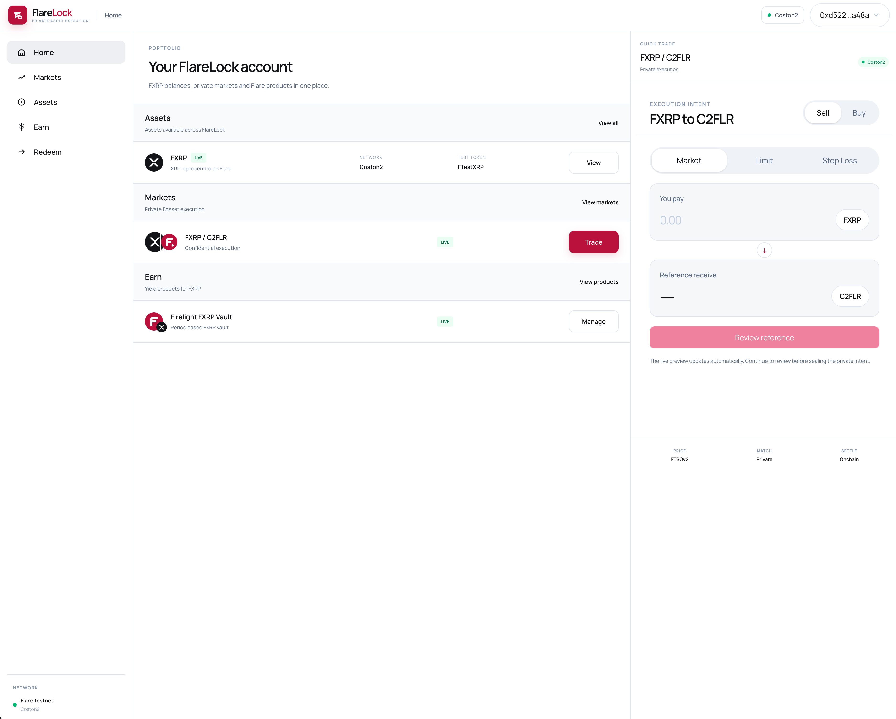
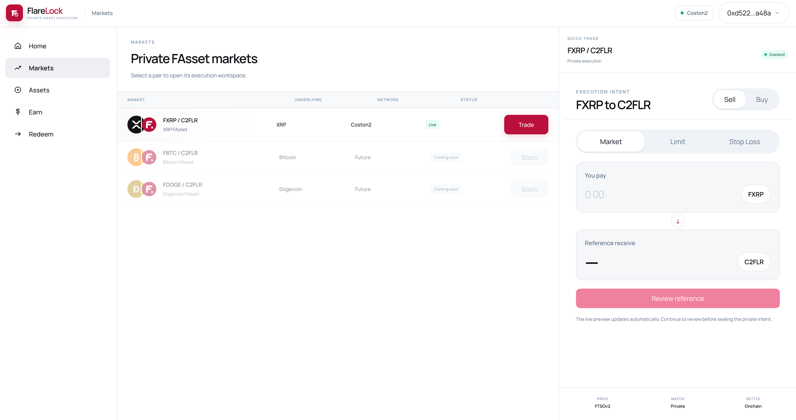
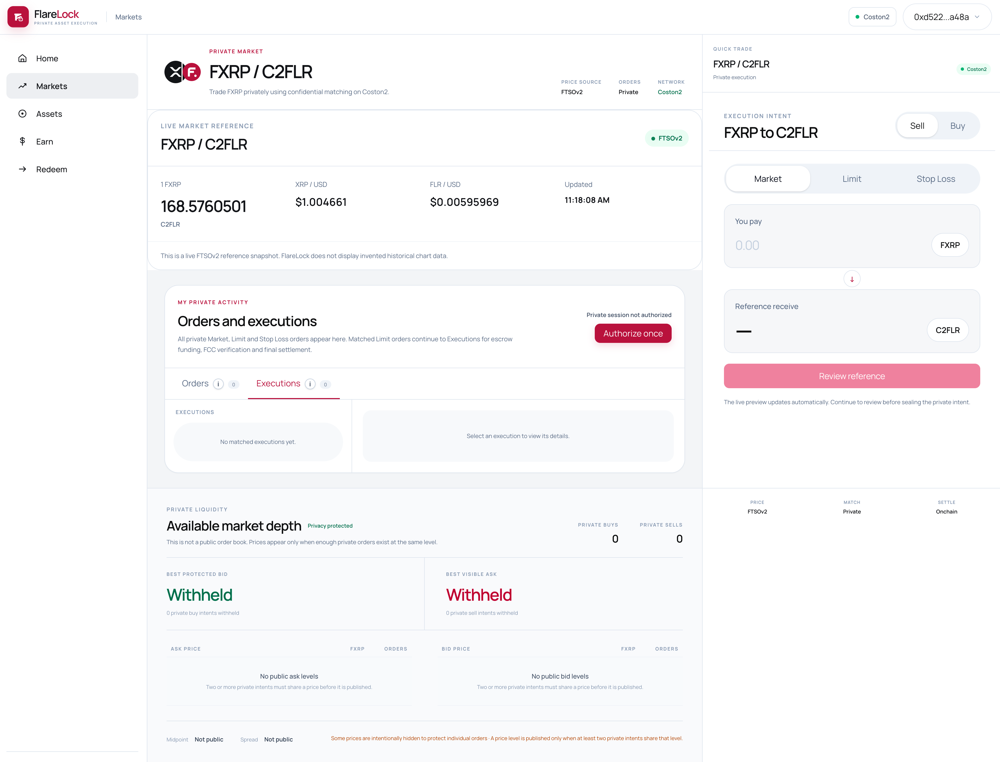
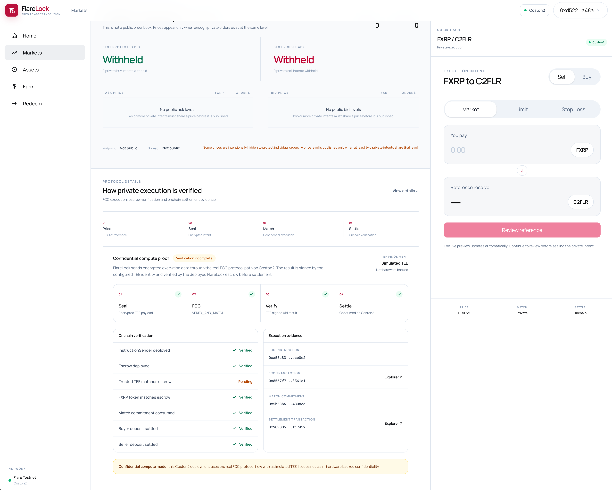
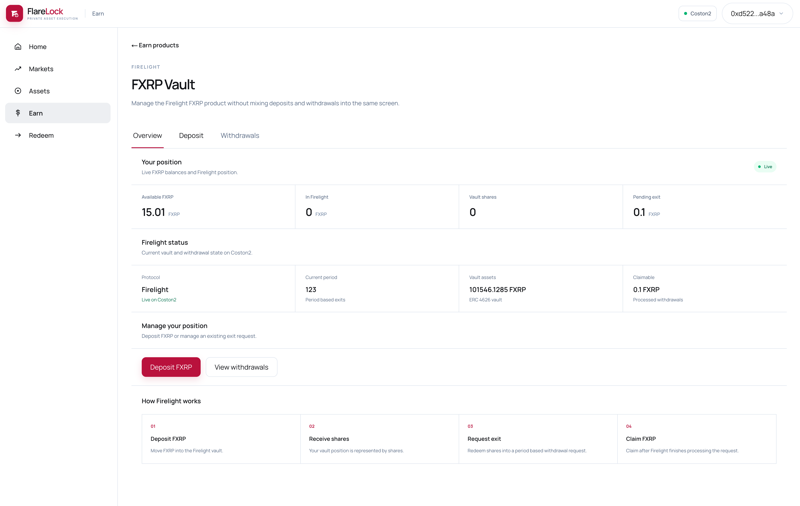
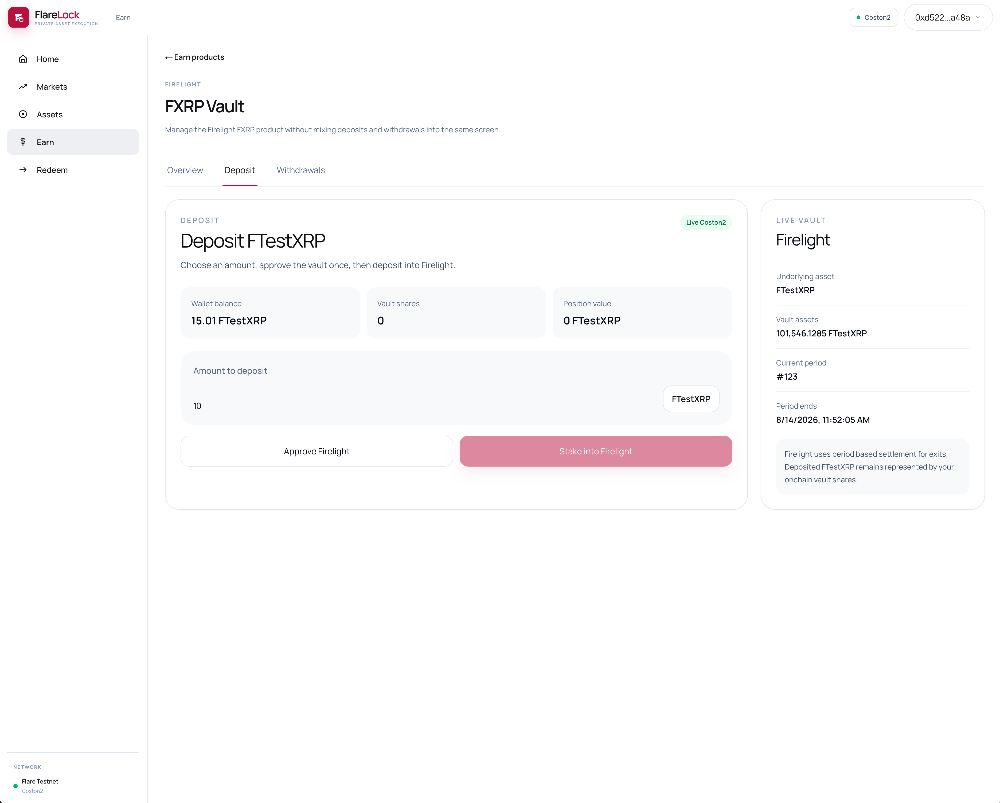
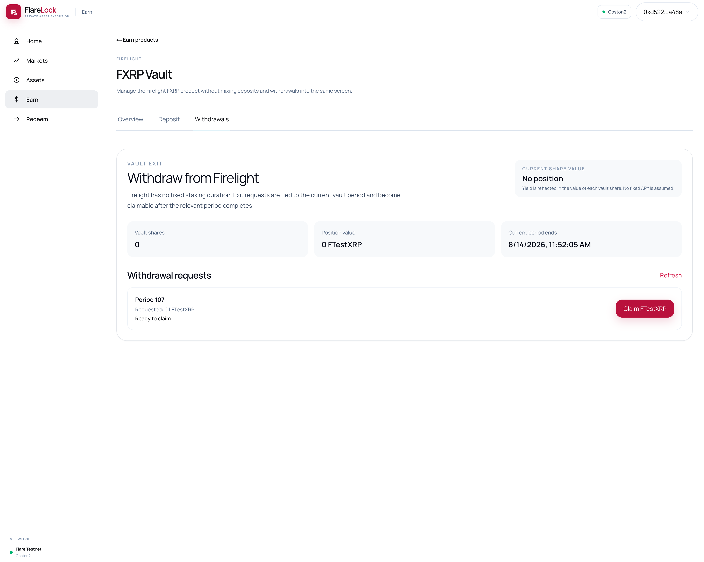
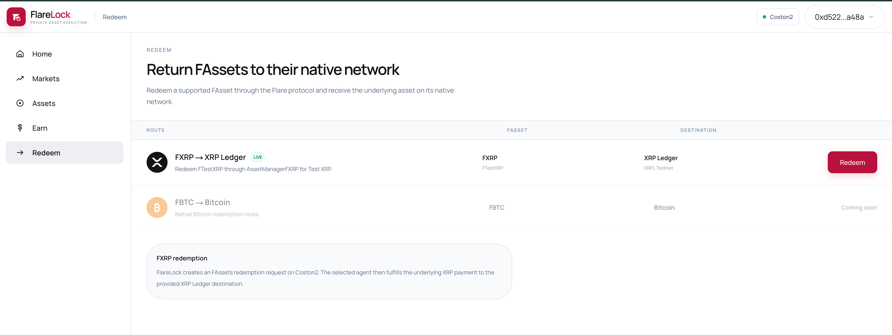
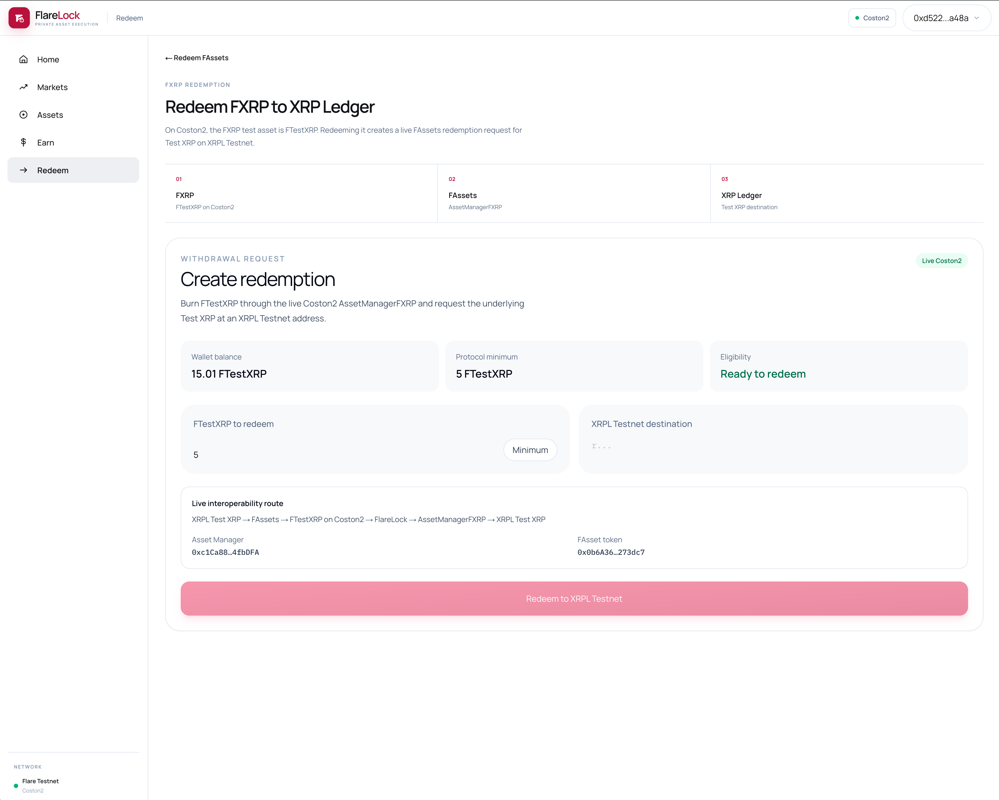

<p align="center">
  
</p>

<h1 align="center">FlareLock</h1>

<p align="center">
  <strong>Private execution. Verifiable settlement.</strong>
</p>

<p align="center">
  Private FXRP execution on Flare using encrypted intents, FTSOv2, Flare Confidential Compute, FAssets, onchain escrow and Firelight.
</p>

<p align="center">
  <a href="https://flarelock.shaderift.com"><strong>Live App</strong></a>
  &nbsp;·&nbsp;
  <a href="https://api.shaderift.com/chain/status"><strong>Live API</strong></a>
  &nbsp;·&nbsp;
  <a href="https://coston2-explorer.flare.network/tx/0x109455da0ea4ba7c98639eec4f08f8653c4bb3eee61c81590767999d969cba24"><strong>Verified Settlement</strong></a>
</p>

<p align="center">
  
  
  
  
  
</p>

<p align="center">
  
  
  
  
  
  
  
</p>

<p align="center">
  
  
  
  
  
  
  
  
</p>

---

## 🎯 What is FlareLock?

FlareLock explores a simple idea:

**Can trading intent remain private until execution is ready while the final settlement stays independently verifiable onchain?**

Public order books reveal useful information before settlement: direction, size, limit price, stop conditions and execution interest.

FlareLock separates **private execution intent** from **public settlement proof**.

Orders are created as encrypted private intents. Compatible Limit orders can be matched privately, funded through an onchain escrow, processed through the FCC execution path and settled atomically on Flare Coston2.

The intent stays private. The result does not.

> **Hide the intent. Prove the settlement.**

---


## 🏆 Hackathon Tracks

FlareLock is designed around two complementary Flare tracks.

### 🌉 Interoperable Asset Products

FXRP is not treated as a passive wallet balance.

Inside FlareLock it participates in a broader lifecycle:

**FXRP trading → private settlement → Firelight yield → FAssets redemption → XRPL destination**

The implementation covers:

- FXRP wallet and asset state
- FXRP / C2FLR execution
- onchain FXRP settlement
- Firelight deposits and vault shares
- Firelight position tracking
- period-based exits and withdrawals
- FAssets redemption requests
- redemption transaction state
- XRP Ledger Testnet destinations

### 🔐 Confidential Compute Apps

Flare Confidential Compute is part of the matched Limit execution architecture.

A fully funded Limit execution moves through:

**encrypted intents → private match → escrow funding → FCC protocol path → settlement instruction → atomic settlement**

The Coston2 prototype uses the FCC protocol flow with the hackathon **simulated TEE environment**. It does not claim hardware-backed confidentiality.

---

## 🔀 Order Types

All three FlareLock order types are private, but they intentionally behave differently.

| Order Type | Current Behaviour |
| --- | --- |
| **Market** | Creates a sealed private intent using current market context and stores it under Orders |
| **Stop Loss** | Creates a sealed conditional intent evaluated by the backend stop service |
| **Limit** | Creates a sealed price-constrained intent that can privately match and enter the full settlement lifecycle |

### ⚡ Market

Market orders express immediate trading intent without publishing order parameters through a public plaintext order book.

The sealed order appears under the authenticated **Orders** view.

### 🛑 Stop Loss

Stop Loss adds an encrypted trigger condition.

The dedicated backend stop service evaluates the trigger state while the order remains private.

### 🎯 Limit

Limit orders implement FlareLock's complete settlement path.

A compatible Buy and Sell Limit pair can move through:

**sealed → matched → funded → FCC execution → settled → receipt**

---

## ⚙️ How a Limit Execution Works

### 1️⃣ Market Context

FTSOv2 provides live Flare-native pricing used by the market view, reference quotes and execution interface.

### 2️⃣ Seal the Intent

The user creates a Buy or Sell Limit order.

The order payload is encrypted before runtime persistence rather than being exposed through a public order book.

### 3️⃣ Match Privately

The backend matching layer finds compatible Limit intents.

A successful pair becomes an Execution visible through authenticated private activity.

### 4️⃣ Fund Escrow

Both counterparties fund the deployed FlareLock escrow:

- buyer deposits C2FLR
- seller deposits FXRP

The API verifies those deposits onchain.

### 5️⃣ Confidential Execution

When both sides are funded, the matched execution moves through the FCC service.

The Coston2 hackathon environment runs the FCC protocol path with a simulated TEE identity and produces the settlement instruction consumed by the escrow flow.

### 6️⃣ Atomic Settlement

The escrow completes both sides of the exchange:

**seller FXRP → buyer**

**buyer C2FLR → seller**

The final transaction and `MatchSettled` event remain publicly verifiable.

---

## 🔗 Flare Integrations

### 📈 FTSOv2

FTSOv2 powers:

- FXRP / C2FLR market context
- conversion quotes
- reference pricing
- execution information
- risk and trading UI

### 🕶 Flare Confidential Compute

FCC provides the confidential execution protocol path for matched Limit orders.

Production path:

**FlareLock API → FCC proxy → simulated TEE environment → settlement instruction → FlareLock escrow**

FCC endpoint: `https://fcc.shaderift.com`

### 🌉 FAssets / FXRP

FXRP is the main interoperable execution asset in FlareLock.

It is used for:

- wallet FXRP state
- private FXRP execution
- escrow settlement
- FAssets redemption
- XRP Ledger Testnet destination flow

### 🔥 Firelight

FlareLock connects idle FXRP with Firelight.

The application exposes:

- deposits
- vault shares
- position value
- vault assets
- current settlement period
- exit requests
- pending exits
- processed / claimable withdrawals

---

## 🧱 Technical Architecture

FlareLock runs as three independent application layers.

### 🌐 Web Application

The frontend is a **Next.js 16** application deployed on Vercel.

Production: `https://flarelock.shaderift.com`

It handles wallet interaction, private order creation, Orders and Executions, escrow funding transactions, settlement receipts, FXRP state, Firelight and redemption UX.

### ⚙️ FlareLock API

The backend is a **NestJS + Fastify** service running on AWS EC2 behind Caddy.

Production: `https://api.shaderift.com`

It handles:

- chain state
- FTSOv2 data
- intent sealing
- encrypted persistence
- wallet-authenticated private activity
- private matching
- stop evaluation
- escrow planning
- funding verification
- FCC orchestration
- settlement state
- FAssets data
- Firelight data

### 🔒 FCC Infrastructure

The FCC proxy, simulated TEE environment and Redis run separately in Docker.

This separation allows the normal application API to be updated without replacing the FCC execution environment.

---

## ✨ Features of FlareLock

| Feature | What it does |
| --- | --- |
| **Private Market Orders** | Creates encrypted immediate-execution intents without publishing the order parameters |
| **Private Limit Orders** | Creates price-constrained encrypted intents that can privately match |
| **Private Stop Loss Orders** | Creates encrypted conditional intents evaluated by the stop service |
| **Wallet-Authenticated Activity** | Protects private Orders and Executions behind wallet authentication |
| **Private Matching** | Matches compatible Buy and Sell Limit intents without exposing a public plaintext order book |
| **FTSOv2 Pricing** | Supplies live Flare-native FXRP / C2FLR market and reference pricing |
| **Escrow Funding** | Verifies buyer C2FLR and seller FXRP deposits onchain |
| **Confidential Execution** | Sends fully funded matched Limit executions through the FCC protocol path |
| **Atomic Settlement** | Exchanges FXRP and C2FLR through the deployed FlareLock escrow |
| **Settlement Receipts** | Shows transaction, counterparties, amounts and onchain settlement evidence |
| **Private Market Depth** | Withholds individual private price levels until enough intents share the same level |
| **FAssets / FXRP** | Uses FXRP for trading, settlement and redemption state |
| **Firelight Earn** | Supports FXRP deposits, vault shares, positions and exit lifecycle |
| **FAssets Redemption** | Creates the FXRP redemption flow toward an XRP Ledger Testnet destination |
| **Responsive Interface** | Provides desktop and mobile trading, assets, Earn and Redeem experiences |
| **Action-Driven Activity** | Avoids aggressive continuous polling in private activity |

### 🚧 Current Execution Boundary

The complete matched settlement lifecycle currently applies to **Limit orders**:

**Limit → Match → Escrow → Fund → FCC → Settle → Receipt**

Market and Stop Loss are implemented as private intent products but do not currently enter the Limit-only settlement flow.

This distinction is deliberate and enforced by both the backend and the UI.

---

## 🖥 Product Tour

### 🏠 Account and Markets

<p align="center">
  
  
</p>

The account workspace brings FXRP assets, private markets and Firelight products into one application.

The Markets view exposes the live FXRP / C2FLR pair while keeping individual private order levels protected.

### 🔐 Private Execution

<p align="center">
  
  
</p>

The execution workspace combines FTSOv2 pricing, private Orders and Executions, protected market depth, FCC execution evidence and onchain settlement verification.

### 🔥 Firelight

<p align="center">
  
  
  
</p>

FXRP can move from execution into a Firelight vault position and later through the period-based exit and claim lifecycle.

### 🌉 FXRP Redemption

<p align="center">
  
  
</p>

The Redeem experience uses the Coston2 FAssets flow to create an FXRP redemption request for an XRP Ledger Testnet destination.

---

## 🔐 Privacy and Authentication

### 🗄 Encrypted Runtime State

The hackathon prototype stores private runtime state in:

- `sealed-intents.json`
- `matches.json`
- `stop-triggers.json`
- private `.intent-key`

Sensitive runtime state and encryption keys are excluded from Git.

Local development and production maintain independent runtime stores.

### 🔑 Wallet Authentication

Private Orders and Executions require wallet authentication.

The user signs once for the private activity session, and the frontend reuses that authorization during normal navigation.

Explicit disconnect clears FlareLock's local wallet session state.

### 🔄 Action-Driven Updates

The final frontend avoids aggressive private-activity polling.

It uses:

- authenticated initial loading
- immediate local updates after order creation
- scoped query invalidation
- updates after user actions
- explicit **Check for updates**

---

## ✅ Verified Coston2 Settlement

FlareLock has completed an atomic matched Limit settlement on Coston2 through the deployed FCC protocol and escrow path.

### 🔗 Match

`match_720a5a0b-95a7-454e-9bb0-0952de1f5b1b`

### 🧾 Settlement Transaction

[`0x109455da0ea4ba7c98639eec4f08f8653c4bb3eee61c81590767999d969cba24`](https://coston2-explorer.flare.network/tx/0x109455da0ea4ba7c98639eec4f08f8653c4bb3eee61c81590767999d969cba24)

### 💱 Result

- 0.01 FXRP transferred to the buyer
- 1.6 C2FLR transferred to the seller
- buyer and seller escrow deposits were consumed
- the transaction emitted `MatchSettled`
- the resulting asset transfers are independently verifiable on Coston2

---

## 🌐 Live Deployment

| Component | Deployment |
| --- | --- |
| Web | https://flarelock.shaderift.com |
| API | https://api.shaderift.com |
| API Status | https://api.shaderift.com/chain/status |
| FCC | https://fcc.shaderift.com |
| Network | Flare Coston2 Testnet |
| Chain ID | 114 |

### 📜 Protocol Addresses

| Component | Address |
| --- | --- |
| FlareLock Escrow | [`0x71A27096640D3D24545D505B5F830ea3d94355d6`](https://coston2-explorer.flare.network/address/0x71A27096640D3D24545D505B5F830ea3d94355d6) |
| Instruction Sender | `0xaeB8E980C87E58093E02d8d45698Fc9ECBb42cea` |
| Configured TEE Identity | `0x427AdD02E981D73146Aa16173ec1d44e003429Bf` |
| FXRP | `0x0b6A3645c240605887a5532109323A3E12273dc7` |

---

## 🛠 Tech Stack

| Layer | Technology |
| --- | --- |
| Frontend | Next.js 16, React 19, TypeScript, Tailwind CSS |
| Wallet / Web3 | Wagmi, Viem |
| Client State | TanStack Query, Zustand |
| Backend | NestJS, Fastify, TypeScript |
| Contracts | Solidity, Foundry |
| Flare | Coston2, FTSOv2, FAssets / FXRP, FCC, Firelight |
| Infrastructure | Vercel, AWS EC2, Caddy, Docker |
| Monorepo | Yarn 4 workspaces, Turbo |

---

## 🔌 API Surface

| Area | Route |
| --- | --- |
| Chain | `GET /chain/status` |
| Confidential | `GET /chain/confidential` |
| Quote | `GET /convert/quote` |
| Risk | `GET /risk/preview` |
| Seal Intent | `POST /intents/seal` |
| Private Activity | `POST /matches/activity` |
| Matching | `POST /matches/run` |
| Execution | `GET /matches/:matchId/execution` |
| Escrow Plan | `POST /matches/:matchId/escrow-plan` |
| Funding | `POST /matches/:matchId/funding` |
| Settlement | `POST /matches/:matchId/settle` |
| Stops | `GET /stops/status`, `POST /stops/run` |
| FXRP Wallet | `GET /fassets/fxrp/wallet/:owner` |
| Redemption | `GET /fassets/fxrp/redemption/:owner` |
| Firelight | `GET /yield/firelight/wallet/:owner` |

---

## 📚 Documentation

For deeper project details:

- [Architecture](docs/architecture.md) — protocol components, privacy model, FCC path and settlement architecture
- [Demo Plan](docs/demo_plan.md) — end-to-end product demonstration flow
- [Project Pitch](docs/pitch.md) — concise problem, solution and hackathon-track summary

---

## 📁 Repository Layout

- `frontend/apps/web` — Next.js production application
- `frontend/packages` — shared configuration, UI and Web3 packages
- `backend/apps/api` — FlareLock API
- `backend/packages` — matching, risk and shared backend modules
- `contracts` — Solidity contracts, tests and deployment scripts
- `confidential/fcc_service` — FCC proxy and execution infrastructure
- `docs/images` — README product screenshots

---

## 🧪 Prototype Status

| Capability | Status |
| --- | --- |
| Coston2 Deployment | **Live** |
| FTSOv2 Pricing | **Live** |
| Private Market Intents | **Implemented** |
| Private Limit Intents | **Implemented** |
| Private Stop Loss Intents | **Implemented** |
| Wallet-Authenticated Activity | **Implemented** |
| Private Limit Matching | **Live** |
| Escrow Funding | **Live on Coston2** |
| FCC Protocol Integration | **Live on Coston2** |
| Atomic FXRP / C2FLR Settlement | **Verified** |
| Settlement Receipts | **Implemented** |
| Protected Private Market Depth | **Implemented** |
| FAssets / FXRP State | **Implemented** |
| Firelight Deposit / Position | **Implemented** |
| Firelight Exit / Withdrawal | **Implemented** |
| FAssets Redemption Flow | **Implemented** |
| Responsive Application | **Live** |

---

## 🗺 Roadmap

### 🔜 Execution

- extend settlement support beyond Limit orders
- connect Market execution to the settlement pipeline
- route triggered Stop Loss intents into confidential execution
- add additional FAsset markets

### 🛡 Production Hardening

- replace lightweight JSON runtime persistence with durable encrypted storage
- use server-issued nonce sessions for private activity authentication
- expand cancellation and recovery for partially funded executions
- prepare the contracts and infrastructure for formal security review

### 🌉 Interoperability

- continue the FXRP redemption lifecycle through complete XRP Ledger settlement validation
- expand the same execution and redemption model to additional FAssets

---

## ⚠️ Testnet Notice

FlareLock is currently a **hackathon prototype deployed on Flare Coston2 testnet**.

It is intended for demonstration and technical evaluation.

### 🧪 Test Assets

The current C2FLR, FTestXRP / FXRP and XRP Ledger destination flows use testnet assets.

### 🔒 Confidential Compute Environment

The current Coston2 FCC deployment uses the FCC protocol path with a **simulated TEE environment**.

It does not claim hardware-backed confidentiality.

### 🛡 Security

The current contracts and backend have not undergone a production security audit.

Runtime persistence is deliberately lightweight for the hackathon prototype.

### 🚫 Mainnet Usage

The current deployment is not intended for real mainnet funds.

---

## 💻 Local Development

### 📦 Requirements

- Node.js 22+
- Yarn 4.17.1
- Foundry

### ⬇️ Install

```bash
corepack enable
yarn install
```

### ▶️ Run

```bash
yarn dev:stack
```

Local services:

- Web: `http://localhost:3000`
- API: `http://localhost:4000`

Frontend environment:

```env
NEXT_PUBLIC_API_URL=http://localhost:4000
```

---

## 🔥 Why Flare?

FlareLock is built by composing Flare primitives into one product rather than treating them as isolated integrations.

### 📈 FTSOv2

Provides live market intelligence.

### 🌉 FAssets

Brings XRP liquidity onto Flare as FXRP.

### 🔐 FCC

Provides the confidential execution protocol path.

### ⛓ Escrow

Makes the final asset settlement independently verifiable.

### 🔥 Firelight

Gives FXRP a productive lifecycle outside active execution.

<p align="center">
  <strong>FTSOv2 for intelligence · FCC for privacy · FAssets for interoperability</strong>
</p>

<p align="center">
  <strong>Escrow for settlement · Firelight for capital efficiency</strong>
</p>

<h3 align="center">Hide the intent. Prove the settlement.</h3>
